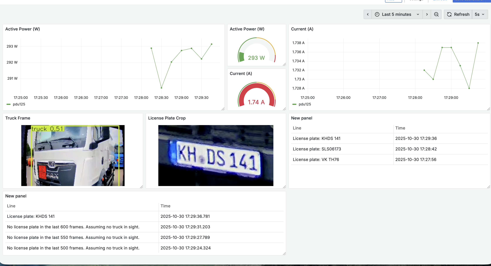

# For now, READMEs inside each dir.

##### Grafana visualization


This is made possible because I load an HTML script inside a `Text` Panel which loads these images.

```HTML
<div style="display:flex;justify-content:center;align-items:center;width:100%;">
  
</div>

<script>
(() => {
  const IMG_URL = 'http://<http_server>:8081/latest.jpg';
  const img = document.getElementById('truck_frame');
  let timer = null;

  function loadOnce() {
    const tmp = new window.Image();
    tmp.onload = () => { img.src = tmp.src; };
    // optional: tmp.onerror = () => {};
    tmp.src = IMG_URL + '?cb=' + Date.now();
  }

  function start() {
    if (timer) return;
    loadOnce();
    timer = setInterval(loadOnce, 5000); // 2s; change to 3000 for 3s
  }
  function stop() {
    if (!timer) return;
    clearInterval(timer);
    timer = null;
  }

  document.addEventListener('visibilitychange', () => {
    if (document.hidden) stop(); else start();
  });

  start();
})();
</script>
```

##### HTTP server
I run a small `HTTP` web server container alongside the detection/analysis containers which serves the frames that those containers save in `/frames/latest.png`.

Small HTTP web server: [darkhttpd](https://github.com/emikulic/darkhttpd)

This is the snippet on my `docker-compose.yaml` 
```
  frameserver:
    image: alpine:3.20
    command: >
      sh -c "apk add --no-cache darkhttpd &&
             darkhttpd /frames --port 8081 --no-listing --addr 0.0.0.0"
    volumes:
      - frames:/frames:ro
    ports:
      - "8081:8081"
    restart: unless-stopped
```

##### Grafana edits
These edits are done in `/etc/grafana/grafana.ini`

You have to allow unsafe HTML scripting for the panels to work. This should not be done for publicly accessed dashboards. Ours is secured.
```
[panels]
# If set to true Grafana will allow script tags in text panels. Not recommended as it enable XSS vulnerabilities.
disable_sanitize_html = true
```

You also need to force Grafana to serve HTTP instead of HTTPS, else the script above won't load.
```
[server]
# Protocol (http, https, h2, socket)
protocol = http
```
